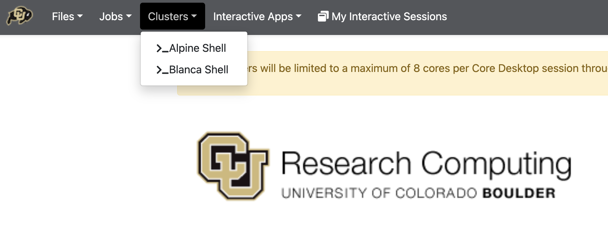

# Module 9 Deeptools analysis 

## Introduction

Deeptools is for visualizing, analyzing DNA-seq next generation sequencing (ngs) experiments.

Requires High Performance Computing (HPC), which requires linux.

Required too much background, practice. ***BUT*** I got *bash jupyter notebooks* working. 

Allows us to work on linux, learning analysis, using command line and bash inside of **code cells**, like code chunks in RMarkdown.

Drawback - not hands on learning of bash/command line
- take DSCI510 (Linux as a computational platform) in the fall.
- DSCI512 (RNA-seq analysis) for more experience.
- use CMB code club for materials/tutorials
    - we're planning on some regular workshop-style topics in the summer
    - may ask help adapting material

## What we're doing this week

- Monday
    - 1st hour - David: 
        - Overview of HPC, getting started on Alpine Web Interface
        - Run setup code on Alpine using Jupyter BASH notebooks 
        - Troubleshoot if necessary
    - 2nd hour - Sarah Swygert:
        - Overview of ChIP-based methods
- Wednesday
    - Sarah Swygert: Deeptools analysis and Exercises

---


## Background 

[Why biologists need high performance computing (HPC) (video)](https://youtu.be/eQ660XXG9MI?si=taE-LA_GYI7DF5ue)


## Alpine Overview (from DSCI510)

**Supercomputers** in the crudest terms are basically what happens if
you glued 100\'s or 1000\'s of individual computers together. You end up
making a giant computer with more functionality.

The supercomputer we\'ll be using is **ALPINE** and it lives on CU
Boulder campus. ALPINE is a joint venture between Colorado State
University and CU Boulder and is sponsored by those institutes and by a
grant from the National Science Foundation. **ALPINE** is shared between
CU Boulder, Colorado State University, CU Anschutz, and RMACC (Rocky
Mountain Advanced Computing Consortium, a network of \>20 other academic
institutions in Colorado, Arizona, Idaho, Montana, and New Mexico).

There is a list of the [Top 500 biggest
supercomputers](https://www.top500.org/lists/top500/list/2023/06/) on
the planet (as of June 2023). According to this list, the largest
supercomputer is **FRONTIER** located at Oak Ridge National Labs in
Tennessee and run by the DOE (US Department of Energy).

How do these supercomputer systems compare to our laptops?


  |**Typical laptop**                 | **Alpine Supercomputer**  |  **FRONTIER Supercomputer**|
  |-----------------------------------|---------------------------|---------------------------|
  |0.1 - 10 teraFLOPS                 |450 teraFLOPS              |1,102,000 teraFLOPS        |
  |1 - 4 cores organized onto 1 node  |>15,500 cores on 458 nodes |    8,730,112 cores        |
  

-   FLOPS: a measure of how many floating point operations a computer
    can do per second. So it\'s a measure of calculations a second
-   Node: Like a miniature computer within the cluster
-   Core: Independent processing unit on a CPU (central processing unit)

**A *cluster* of nodes**

<figure>
    
    <figcaption>https://www.hpc2n.umu.se/documentation/guides/beginner-guide</figcaption>
</figure>

Within each node is the set of resources- CPUs, memory, motherboard, cooling system.

**A compute node (blade)**

<figure>
    
    <figcaption>ACT blade from https://www.advancedclustering.com</figcaption>
</figure>

------------------------------------------------------------------------

### What are the benefits and drawbacks of using a supercomputer?

**Benefits**

-   power, efficiency, and speed!!!
-   team of professionals to help set up the system and provide user
    support
-   allows for collaboration with other users

**Drawbacks**

-   There is a learning curve
-   Multi-user platform requires job-sharing - there is usually a queue
    to execute your code
-   May not have architecture specialized for your task.


### Video: Logging on to Alpine Web Interface

[CU Research computing (video) - logging on with Open OnDemand](https://www.youtube.com/watch?v=cP6lfRWywk0)

 **EXERCISE**: Let\'s connect to ALPINE using OnDemand but with changes for CSU:

-   Navigate to [https://ondemand-rmacc.rc.colorado.edu](https://ondemand-rmacc.rc.colorado.edu) in a new tab
    or window
    -   For me, I right click on the above link and select **Open Linkin New Window**
    -   You will be asked to select an identity provider using a
        pull-down menu. Select on the pull-down menu (it may say
        **ORCID**). Start typing **Colorado State University**. Click on
        **Remember** and log in. It should look like this


### Video: Alpine File Organization

[CU Research computing (video) - File system](https://www.youtube.com/watch?v=xfeRDnZQrJ4&t=18s)

-   Go to **CLUSTERS** and select **\>\_Alpine Shell**



Now we want to go to our project directory and clone the class repository.

```
cd /projects/$USER
git clone https://github.com/Colorado-State-University-CMB/CM515-course-2024.git
```

Now let's see the files that were downloaded.

Using the *Files* pull down menu, go to your /projects directory as below:

<figure>
    
    <figcaption>Screen image caught mid-file navigation</figcaption>
</figure>

<figure>
    
    <figcaption>You arrive at the repo</figcaption>
</figure>

<figure>
    
    <figcaption>/projects/dcking@colostate.edu/CM515-course-2024/modules/09_Deeptools/ hovering on <b>setup</b>
    </figcaption>
</figure>
